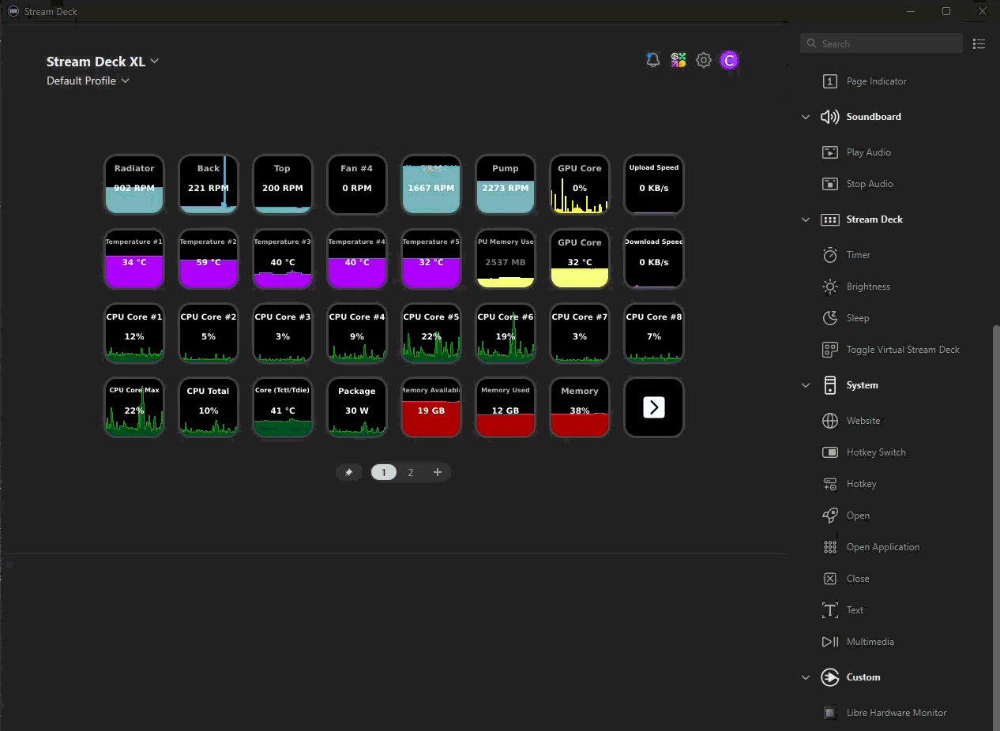
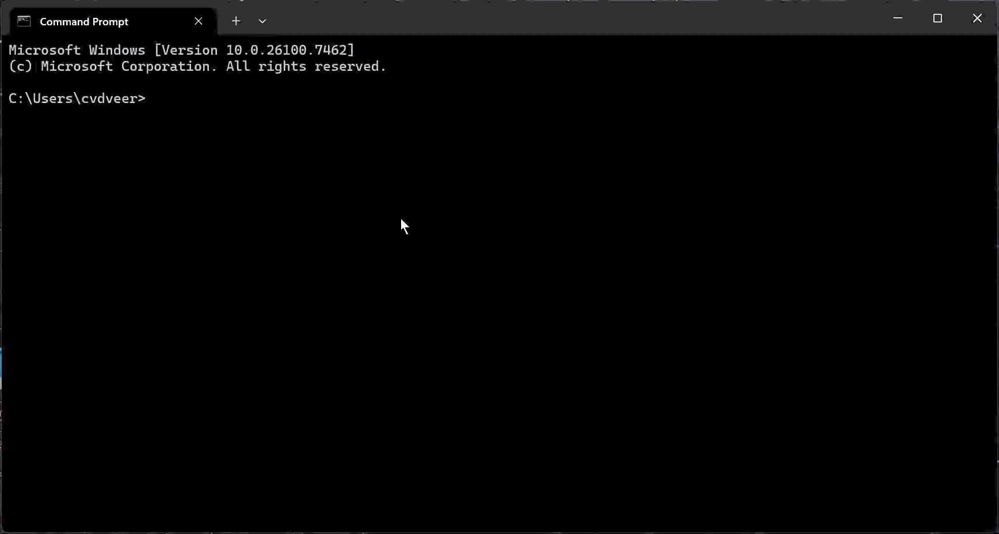
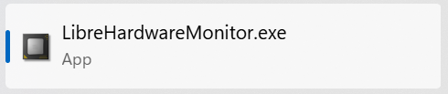
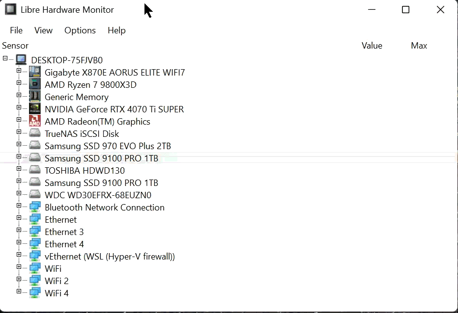
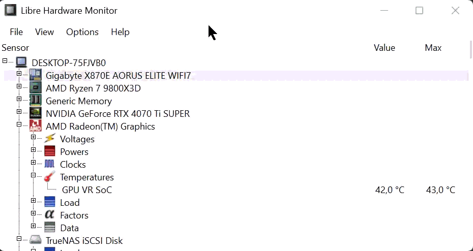
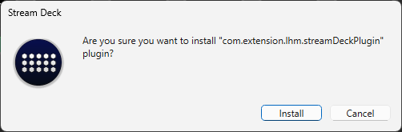
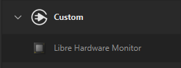

# Libre Hardware Monitor Stream Deck Plugin

---

> The plugin now talks to [Libre Hardware Monitor](https://github.com/LibreHardwareMonitor/LibreHardwareMonitor) over its HTTP bridge.

## Motivation

I wanted a local, open replacement for Stream Deck hardware monitoring without leaning on commercial tooling that did not fit my constraints. This fork keeps Shayne's original hwinfo plugin workflow while swapping the backend for Libre Hardware Monitor and documenting the refreshed setup.

## Configuring Libre Hardware Monitor

1. Install Libre Hardware Monitor **v0.9.5 or newer**.
   v0.9.5+ is required to avoid WinRing0 driver warnings and missing tiles after LHM restarts/updates.

   > **Note:** The stable 0.9.5.0 release may crash on startup due to a [DiskInfoToolkit bug](https://github.com/LibreHardwareMonitor/LibreHardwareMonitor/issues/2148) when unpartitioned drives are present. If affected, use a nightly build from [GitHub Actions](https://github.com/LibreHardwareMonitor/LibreHardwareMonitor/actions) that includes the fix.

    
2. Launch `LibreHardwareMonitor.exe`.

    
3. Open `Options -> Remote Web Server...`.
4. Check **Active**, set the port to `8085`, and set **Listen IP** to `0.0.0.0` (recommended) or your local IP.
   Both options expose the web server on your network. Use firewall rules to prevent external access if you only want
   local-only access.

    
5. Select **Run** to enable the server.
6. Check the top 4 options to set lhm to autorun on startup.

    
6. Verify things are working by opening [http://127.0.0.1:8085/data.json](http://127.0.0.1:8085/data.json). If you chose
   a specific local IP, you can also use that IP in the URL. Keep Libre Hardware Monitor running while you use the Stream
   Deck action.

> Advanced: set the `LHM_ENDPOINT` environment variable before launching Stream Deck if you prefer another URL (e.g. a different port or host). If you bind LHM to a specific local IP, set `LHM_ENDPOINT` to match that IP and port. The default endpoint is `http://127.0.0.1:8085/data.json`.

## Install and Setup the Plugin

1. Download the latest pre-compiled plugin

    [Plugin Releases](../../releases)

    > When upgrading, first uninstall: within the Stream Deck app choose "More Actions..." (bottom-right), locate "Libre Hardware Monitor" and choose "Uninstall". Your tiles and settings will be preserved.

2. Double-click to install the plugin

3. Choose "Install" went prompted by Stream Deck

    

4. Locate "Libre Hardware Monitor" under "Custom" in the action list

    

5. Drag the "Libre Hardware Monitor" action from the list to a tile in the canvas area

    

6. Configure the action to display the sensor reading you wish

    

### Title behavior

- By default the tile shows the reading label returned by Libre Hardware Monitor inside the graph area.  
- Entering text in the **Title** field replaces that label; Stream Deck stores the custom string per action.
- If you enable the **Show Title** checkbox in Stream Deck’s title settings, the text renders outside the graph (the standard Stream Deck caption) while the graph can be left empty.  
- Clearing the Title field while **Show Title** is enabled produces an empty caption, letting you hide the text entirely when you only want the graph.

## Credits

Based on the excellent [hwinfo-streamdeck](https://github.com/shayne/hwinfo-streamdeck) project by Shayne. Portions of this implementation and README were drafted with AI assistance and reviewed before release.

## Upstream diff (proof of origin)

Upstream is archived (read-only). Changes in this fork are visible here:
https://github.com/shayne/hwinfo-streamdeck/compare/main...moeilijk:lhm
