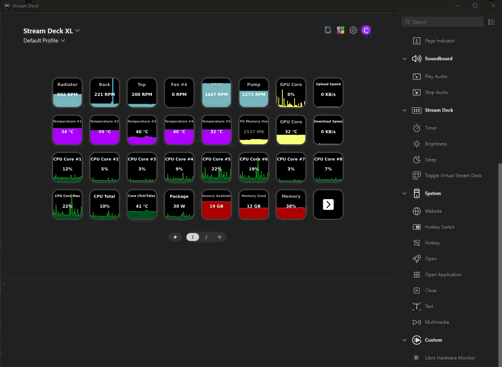
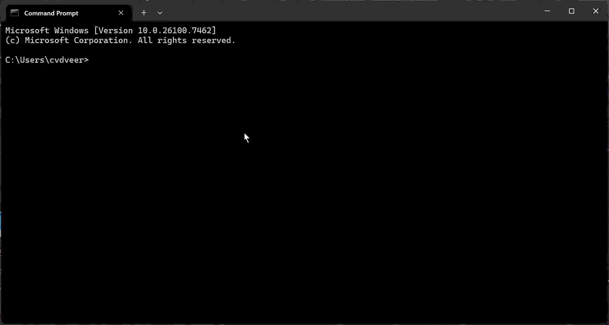
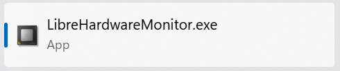
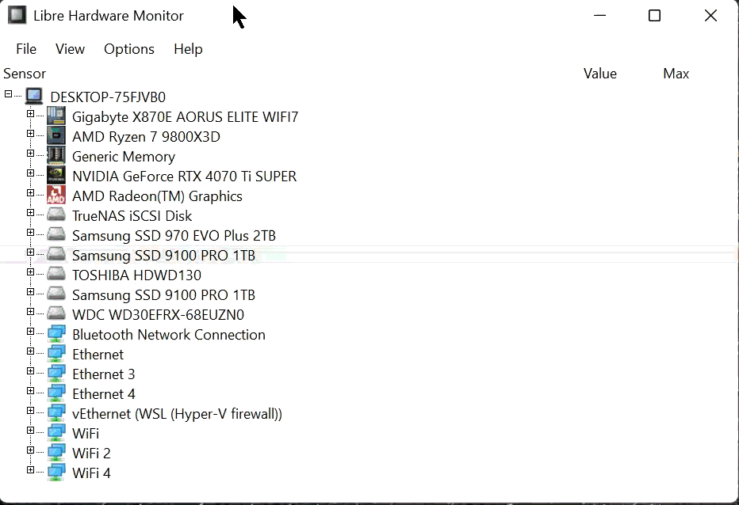
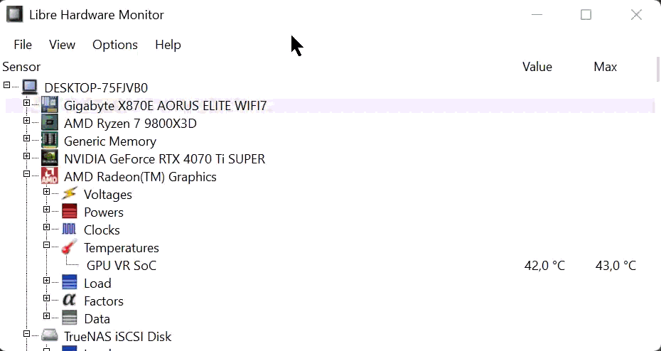
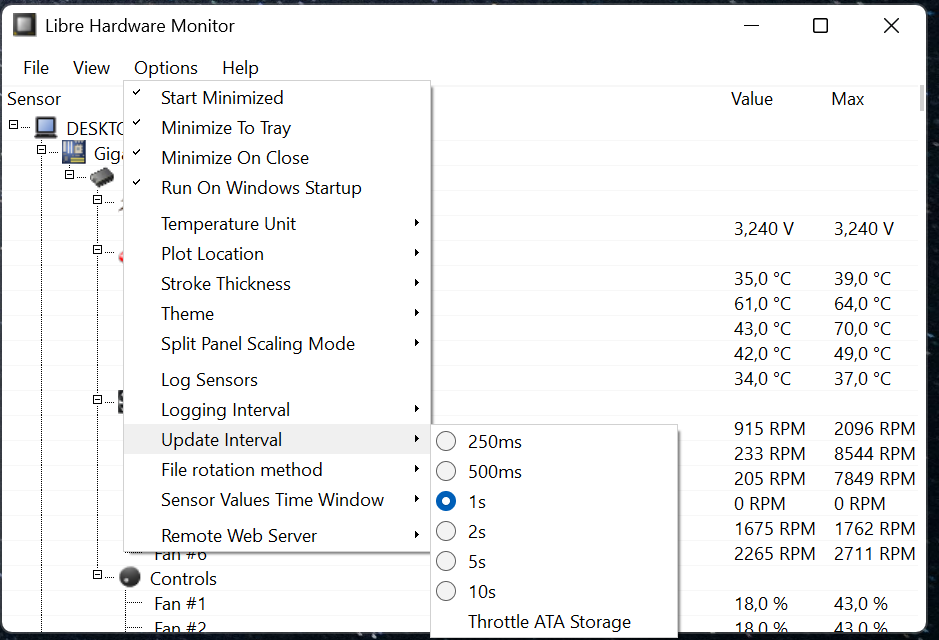
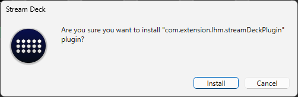
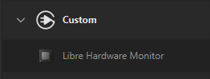
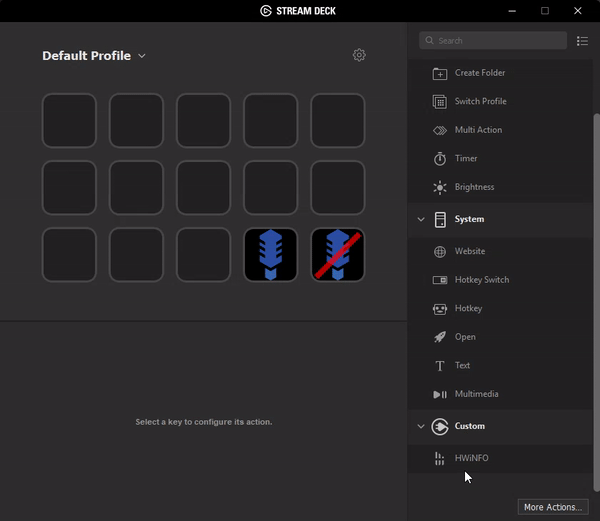
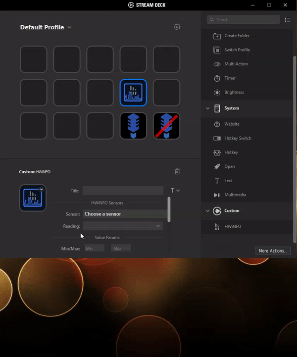

# Libre Hardware Monitor Stream Deck Plugin

---

> The plugin now talks to [Libre Hardware Monitor](https://github.com/LibreHardwareMonitor/LibreHardwareMonitor) over its HTTP bridge.

## Motivation

I wanted a local, open replacement for Stream Deck hardware monitoring without leaning on commercial tooling that did not fit my constraints. This fork keeps Shayne's original hwinfo plugin workflow while swapping the backend for Libre Hardware Monitor, adding multi-machine monitoring, and documenting the refreshed setup.

## Configuring Libre Hardware Monitor

1. Install Libre Hardware Monitor **v0.9.5 or newer**.
   v0.9.5+ is required to avoid WinRing0 driver warnings and missing tiles after LHM restarts/updates.

   > **Note:** The stable 0.9.5.0 release may crash on startup due to a [DiskInfoToolkit bug](https://github.com/LibreHardwareMonitor/LibreHardwareMonitor/issues/2148) when unpartitioned drives are present. If affected, use a nightly build from [GitHub Actions](https://github.com/LibreHardwareMonitor/LibreHardwareMonitor/actions) that includes the fix.

    
2. Launch `LibreHardwareMonitor.exe`.

    
3. Open `Options -> Remote Web Server...`.
4. Check **Active**, set the port to `8085`, and set **Listen IP** to `0.0.0.0` (recommended) or your local IP.
   Both options expose the web server on your network. Use firewall rules to prevent external access if you only want
   local-only access.

    
5. Select **Run** to enable the server.
6. Check the top 4 options to set lhm to autorun on startup.

    
7. Verify things are working by opening [http://127.0.0.1:8085/data.json](http://127.0.0.1:8085/data.json). If you chose
   a specific local IP, you can also use that IP in the URL. Keep Libre Hardware Monitor running while you use the Stream
   Deck action.

8. Keep **LHM -> Options -> Update Interval** in sync with the plugin settings tile.
   The plugin does not change LHM's update interval automatically.
   Default in both places is **1s**.

    

## Install and Setup the Plugin

1. Download the latest pre-compiled plugin

    [Plugin Releases](../../releases)

    > When upgrading, first uninstall: within the Stream Deck app choose "More Actions..." (bottom-right), locate "Libre Hardware Monitor" and choose "Uninstall". Your tiles and settings will be preserved.

2. Double-click to install the plugin

3. Choose "Install" when prompted by Stream Deck

    

4. Locate "Libre Hardware Monitor" under "Custom" in the action list

    

5. The plugin includes four actions:
   - **Libre Hardware Monitor** for a single reading tile
   - **LHM Composite Dashboard** for 2–4 readings on one key
   - **LHM Derived Metric** for formulas across 2–8 readings
   - **LHM Settings** for source profiles, polling, and default tile appearance

6. Drag the action you want from the list to a tile in the canvas area

    

7. Configure the action to display the sensor reading you wish

    

   The sensor picker supports **search**, **category filtering**, and **favorites**:
   - Use the search field to filter sensors by name.
   - Use the category dropdown to narrow down to a specific sensor group.
   - Save frequently used sensor/reading combinations as favorites with **Save Current**, then reload them from the favorites dropdown.

### Linux (OpenDeck)

A separate `com.moeilijk.lhm-linux.streamDeckPlugin` is published alongside the Windows release for [OpenDeck](https://github.com/nekename/OpenDeck) users. Install it the same way; configure a source profile pointing to an [lhm-companion](https://github.com/moeilijk/lhm-companion) endpoint.

### Multi-machine source profiles

The plugin can monitor more than one Libre Hardware Monitor endpoint at the same time.

- Use the **LHM Settings** action to create a source profile for each machine you want to monitor.
- Give each profile a name plus host/port so you can switch between local and remote systems cleanly.
- Set a **default source** for new tiles, then override the **Profile** per reading, composite, or derived tile as needed.

This is the main workflow for multi-machine Libre Hardware Monitor setups.

### lhm-companion (Linux sensors)

For Linux machines, use [lhm-companion](https://github.com/moeilijk/lhm-companion) — a lightweight bridge that exposes Linux sensor data (`/sys/class/hwmon`, CPU load, memory, network, storage, NVIDIA GPU) as a `data.json` endpoint in the exact format Libre Hardware Monitor produces. Add a source profile in the plugin settings pointing to the Linux machine's IP and port; all sensor tiles work without any plugin modifications.

### Composite Dashboard tile

The **LHM Composite Dashboard** action displays 2–4 sensor readings on a single Stream Deck key, each with its own graph. Drag it to a tile from the action list.

In its Property Inspector:

- **Mode** – choose what renders on the tile: `Text only`, `Graph only`, or `Graph + Text`.
- **Slots** – choose how many readings to display (2, 3, or 4).
- **Update every** – override the global poll interval for this tile only (`Use global`, `1s`, `2s`, `5s`, `10s`, `30s`, `60s`).
- **Smoothing** – EMA factor α (0.1–1.0). `1.0` = no smoothing. Threshold evaluation always uses the raw value.
- Per slot:
  - **Mode** – optionally override the tile mode for this slot: use the tile mode, `Text only`, `Graph only`, or `Graph + Text`.
  - **Sensor / Reading** – select the sensor and reading to display.
  - **Label** – optional custom label; leave blank to use the reading name.
  - **Highlight / Fill / Value text / Title text / Background** – per-slot colors.
  - **Fill alpha** – graph fill transparency (0–100).
  - **Min / Max** – fixed graph scale; leave blank to auto-scale.
  - **Title size / Value size** – font sizes for the label and value.
  - **Format** – printf-style format string (default: `%.0f`).
  - **Divisor** – divide the raw value before display (e.g. `1000` to convert MB → GB).
  - **Graph unit** – time axis scale for the graph.
  - **Graph height** – render this slot's graph in the bottom N% of its area (10–100).
  - **Line thickness** – width of the highlight stroke at the current value (1–4 px).
  - **Text stroke** – outline around title/value labels, with a configurable stroke color.
  - **Thresholds** – each slot has its own independent threshold list with the same full feature set as the standard tile (operator, value, colors, alert text, hysteresis, dwell, cooldown, sticky, snooze). Slot thresholds only affect that slot's graph area.

Graphs are composited with lighten blending so overlapping areas remain readable. Text is drawn as an overlay on top.

### Derived Metric tile

The **LHM Derived Metric** action combines 2–8 sensor readings into one computed value on a single key.

In its Property Inspector:

- **Profile** – choose which source profile this tile reads from.
- **Formula** – select **sum**, **average**, **max**, **min**, **delta**, or **pct**.
- **Slots** – choose how many readings participate in the formula (2–8; `delta` uses 2).
- **Update every** – override the global poll interval for this tile only (`Use global`, `1s`, `2s`, `5s`, `10s`, `30s`, `60s`).
- **Smoothing** – EMA factor α (0.1–1.0). `1.0` = no smoothing. Threshold evaluation always uses the raw value.
- Per slot:
  - **Favorite / Sensor / Reading** – choose the input reading directly or apply a saved favorite.
  - **Divisor** – divide the raw slot value before the formula runs.
  - **Graph unit** – normalize the slot reading before aggregation when needed.
- Tile-wide:
  - **Title / Value size** – font sizes for the title and value.
  - **Highlight / Fill / Value text / Title text / Background** – tile colors.
  - **Min / Max** – fixed graph scale; leave blank to auto-scale.
  - **Format** – printf-style format string for the computed value.
  - **Divisor** – divide the final computed value after the formula runs.
  - **Graph unit** – output unit for the graph/value display.
  - **Graph height** – render the graph in the bottom N% of the tile (10–100).
  - **Line thickness** – width of the highlight stroke at the current value (1–4 px).
  - **Text stroke** – outline around title/value labels, with a configurable stroke color.
- **Presets** – save and reload derived metric setups so common formulas can be reused quickly.

### Plugin Settings tile

The **LHM Settings** action (found under "Libre Hardware Monitor" in the action list) provides a dedicated tile for plugin-wide configuration. Drag it to any free tile on the canvas.

In its Property Inspector you can set:

- **Profile** – select which source profile you are editing.
- **Add / Delete** – manage multiple source profiles for different machines.
- **Name** – choose a friendly label for the selected source profile.
- **Host** – the IP address or hostname where that profile's endpoint is running.
- **Port** – the port the selected source profile listens on (default: `8085`).
- **Default Source** – choose which profile new tiles should use by default.
- **Interval** – how often the plugin polls LHM for new data (default: `1s`).
- **Tile Appearance** – default background and text colors for all sensor tiles.

Changes to a profile's Host and Port take effect immediately; tiles that target that source reconnect automatically.

### Stream Deck+ Dial Carousel

The **LHM Dial Carousel** action turns a single dial into a scrollable list of sensor readings. Rotate the dial to cycle through the readings, press the dial to toggle an overview, and tap the touch strip to acknowledge or snooze an active alert (the same as pressing a key). It is built on the Stream Deck `Encoder` controller and was tested on the Stream Deck +; any Stream Deck device that exposes a dial with a touch strip can use it.

In its Property Inspector:

- **Pages** – add, reorder, and remove readings; the selected page is the one shown on the device.
- Per page (the same controls as a standard reading tile):
  - **Sensor / Reading** – select the sensor and reading for this page.
  - **Display** – `Both`, `Graph only`, or `Text only`, plus graph height, line thickness and text stroke.
  - **Scale** – Min / Max (leave blank to auto-derive from the reading), Format, Divisor and Graph unit.
  - **Smoothing** – optional EMA smoothing for the displayed value; threshold checks always use the raw value.
  - **Colors / Fonts** – highlight, fill, value text, title text, background; title and value font size (`0` = automatic).
  - **Thresholds / Snooze / Global thresholds** – the full standard threshold feature set per page, including type-scoped global thresholds with per-page suppression.
- **Bulk Add** – create many pages at once by rule (all readings on a sensor, a numbered set such as all CPU cores, or the same reading across matching sensors), with a live preview, individual deselect, and a name template (tokens `%n` number, `%r` reading, `%s` sensor).
- Dial-wide:
  - **Default view** – start in `Fullscreen` or `Overview`.
  - **Overview style** – `Stacked` (full-width strips) or `Carousel` (cards).
  - **Overview pages** – show up to `3` cards/strips, or cap to `2` for larger, more legible previews.
  - **Indicator** – page indicator style (`Auto`, `Dots`, `Count`, `Off`), colour, size, and whether to show it in fullscreen.
  - **Separator** – width and colour of the divider drawn between adjacent dials.
  - **Reverse dial** – flip the rotation direction.

Each new page is given a distinct default colour from a palette so the list is easy to scan, and a page's graph history is preserved when you edit its settings.

### Display options (standard tile)

The standard **Libre Hardware Monitor** tile has a **Display** section in its Property Inspector:

- **Display** – choose what renders on the tile: `Both` (graph + text), `Graph only`, or `Text only`.
- **Graph height** – render the graph in the bottom N% of the tile (10–100). Leaves the top area clear for large text or a clean background.
- **Line thickness** – width of the highlight stroke at the current value position (1–4 px).
- **Text stroke** – draws a configurable-colour outline around the title and value labels.
- **Update every** – override the global poll interval for this tile only (`Use global`, `1s`, `2s`, `5s`, `10s`, `30s`, `60s`).
- **Smoothing** – EMA factor α (0.1–1.0). `1.0` = no smoothing. Threshold evaluation always uses the raw unsmoothed value, so alert accuracy is not affected.

The composite and derived tiles have the same Update every and Smoothing controls at tile level, and Graph height / Line thickness / Text stroke in their appearance settings (per slot for composite).

### Title behavior

- By default the tile shows the reading label returned by Libre Hardware Monitor inside the graph area.  
- Entering text in the **Title** field replaces that label; Stream Deck stores the custom string per action.
- If you enable the **Show Title** checkbox in Stream Deck’s title settings, the text renders outside the graph (the standard Stream Deck caption) while the graph can be left empty.  
- Clearing the Title field while **Show Title** is enabled produces an empty caption, letting you hide the text entirely when you only want the graph.

### Threshold alerts

- Add as many thresholds as you want; each can be enabled/disabled independently.
- Each threshold defines a comparison operator and value (e.g. `>= 70`).
- **Order matters:** thresholds are evaluated **top → bottom**, and the **last match wins**. Use the arrow buttons to move a threshold up/down.
- Per-threshold colors: background, foreground, highlight, value text, and alert text.
- Optional alert text is shown **under** the value; supports `{value}` and `{unit}` placeholders.
- **Hysteresis** – the reading must clear the threshold by this amount before the alert deactivates, preventing rapid on/off flicker.
- **Dwell time** – the threshold must be exceeded for this many milliseconds before the alert activates.
- **Cooldown** – after an alert clears, it cannot trigger again until this many milliseconds have passed (default: 5000 ms).
- **Sticky alerts** – once triggered, the alert stays active until cleared manually by pressing the key.

#### Threshold snooze

Press the key while an alert is active to step through snooze presets: **5m**, **15m**, **1h**, and **Until resumed**. Snoozed tiles render in a muted state with a countdown. Pressing again cycles to the next preset; pressing past the last preset resumes normal alert behavior.

## Credits

Based on the excellent [hwinfo-streamdeck](https://github.com/moeilijk/hwinfo-streamdeck) project by Shayne Sweeney. Portions of this implementation and README were drafted with AI assistance and reviewed before release.

## Code signing

Free code signing provided by [SignPath.io](https://signpath.io/), certificate by [SignPath Foundation](https://signpath.org/).

Windows binaries in [releases](https://github.com/moeilijk/lhm-streamdeck/releases) will be signed through this program so that Windows and antivirus software can verify their origin and integrity.

## License

[GPL-3.0](LICENSE). As a derivative of the original hwinfo-streamdeck plugin, this project carries the same license, applied with the permission of the original author.
